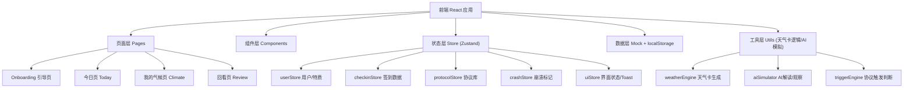
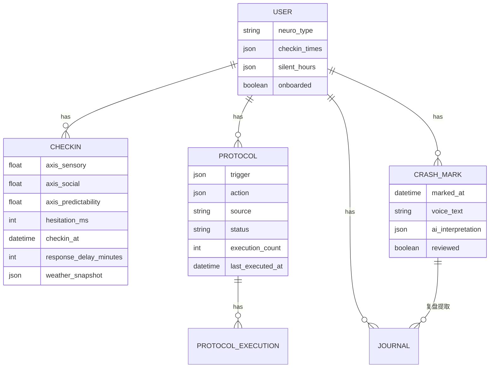

## 1. 架构设计

Demo 版本为纯前端应用，使用 mock 数据 + localStorage 持久化 + 模拟 AI 逻辑，无需后端服务。



## 2. 技术选型

- 前端：React@18 + TypeScript + Vite
- 样式：TailwindCSS@3 + CSS 变量（设计 token）
- 状态管理：Zustand（含 persist 中间件，localStorage 持久化）
- 路由：react-router-dom@6
- 动效：Framer Motion（页面切换/卡片入场/协议触发 slide-up）
- 图标：lucide-react
- 字体：Instrument Serif（标题）/ Outfit（正文）/ JetBrains Mono（数据值）
- 后端：无（Demo 阶段纯前端 mock）
- 数据：localStorage 持久化 + 预置 mock 数据

## 3. 路由定义

| 路由 | 用途 |
|-------|---------|
| `/onboarding` | 首次使用引导：神经特质选择 + 第一协议创建 |
| `/today` | 今日页：天气卡 + 签到 + 协议触发 + 崩溃标记 |
| `/climate` | 我的气候：趋势回放 + 协议管理 + AI 观察 |
| `/review` | 回看页：事后记录 + AI 解读 + 时间线 |
| `/review/:crashId` | 单条崩溃复盘详情 |
| `/protocol/new` | 创建新协议 |
| `*` | 重定向到 `/today` |

## 4. 核心数据结构

### 4.1 数据模型定义



### 4.2 TypeScript 类型定义

```typescript
// 神经特质类型
type NeuroType = 'asd' | 'adhd' | 'hsp' | 'other';

// 气候类型
type ClimateType = 'stuffy_rain' | 'clear_breeze' | 'warm_fog' | 'storm_warning';

// 签到数据
interface CheckIn {
  id: string;
  axis_sensory: number;        // 0-10
  axis_social: number;         // 0-10
  axis_predictability: number; // 0-10
  hesitation_ms: number;
  checkin_at: string;
  response_delay_minutes: number;
  weather_snapshot: WeatherSnapshot;
}

// 天气卡快照
interface WeatherSnapshot {
  climate: ClimateType;
  climate_label: string;
  description: string;
  suitable: string[];
  unsuitable: string[];
}

// 协议
interface Protocol {
  id: string;
  trigger: {
    type: 'threshold' | 'time' | 'behavior';
    axis?: 'sensory' | 'social' | 'predictability';
    operator?: '>' | '<' | '>=';
    value?: number;
    description: string;
  };
  action: {
    description: string;
    duration_minutes: number;
    timer: boolean;
  };
  source: 'manual' | 'ai_suggestion' | 'crash_reflection';
  status: 'active' | 'paused' | 'candidate';
  execution_count: number;
  last_executed_at: string | null;
  created_at: string;
}

// 崩溃标记
interface CrashMark {
  id: string;
  marked_at: string;
  voice_text?: string;
  ai_interpretation?: {
    event: string;
    emotion: string;
    need: string;
  };
  reviewed: boolean;
}
```

## 5. 核心逻辑模块

### 5.1 天气卡生成引擎 (weatherEngine)

Demo 简化版，基于最近一次签到三轴值 + 趋势生成气候类型，无需调用 AI：

| 条件 | 气候类型 |
|---|---|
| 感官负载 ≥ 7 或趋势上升 | 闷热待雨 (stuffy_rain) |
| 三轴均 ≤ 5 且稳定 | 晴朗微风 (clear_breeze) |
| 可预测性 < 4 | 暖雾弥漫 (warm_fog) |
| 感官负载 ≥ 8 或社交电量 ≤ 2 | 雷暴预警 (storm_warning) |

### 5.2 协议触发引擎 (triggerEngine)

监听签到数据变化，匹配协议触发条件。命中后推送（slide-up + backdrop），每天上限 3 次。

### 5.3 AI 模拟器 (aiSimulator)

- **情绪翻译**：基于崩溃语音文本模板生成三段式解读（事件/情绪翻译/需求识别）
- **模式观察**：每周日生成固定格式建议，从 mock 历史数据中提取"协议候选"
- **协议提取**：从复盘内容生成协议草案

## 6. 设计系统 Token

| 用途 | Token | 色值 |
|---|---|---|
| 底色 | `--color-base` | #FAF7F2 |
| 主色 | `--color-primary` | #6B5FA0 |
| 辅色1 | `--color-sage` | #6B9E8A |
| 辅色2 | `--color-clay` | #C4956A |
| 正文 | `--color-text` | #3A352F |
| 次要文字 | `--color-text-muted` | #8A8074 |
| 警告 | `--color-warn` | #C4715A |
| 边框 | `--color-border` | #E0D9CC |

- 圆角：卡片 12px / 大容器 20px / 按钮 999px
- 阴影：`0 2px 12px rgba(58,53,47,0.06)`
- 过渡：200-300ms ease-out
- 行高：1.8

## 7. Demo 范围对齐

| 功能 | 优先级 | Demo 实现 |
|---|---|---|
| F-01 内在天气卡 | P0 | ✅ 基于签到条件逻辑生成 |
| F-02 三轴签到 | P0 | ✅ ASD 维度滑块 + 犹豫时长采集 |
| F-03 协议触发 | P0 | ✅ 阈值匹配 + slide-up 推送 |
| F-04 崩溃标记 | P0 | ✅ 一键标记 + 模拟语音文本 |
| F-06 协议管理 | P0 | ✅ 列表 + 创建 + 暂停 |
| F-08 事后记录 | P0 | ✅ 文字输入 + AI 整理 |
| F-12 Onboarding | P0 | ✅ 特质选择 + 第一协议 |
| F-05 趋势回放 | P1 | ✅ 周视图折线图 |
| F-07 AI 观察 | P1 | ✅ 周日生成观察建议 |
| F-09 AI 解读 | P1 | ✅ 三段式情绪翻译 |
| F-10 沉淀协议 | P1 | ✅ 从复盘提取协议候选 |
| F-11 时间线 | P2 | ✅ 按时间倒序排列事件 |
